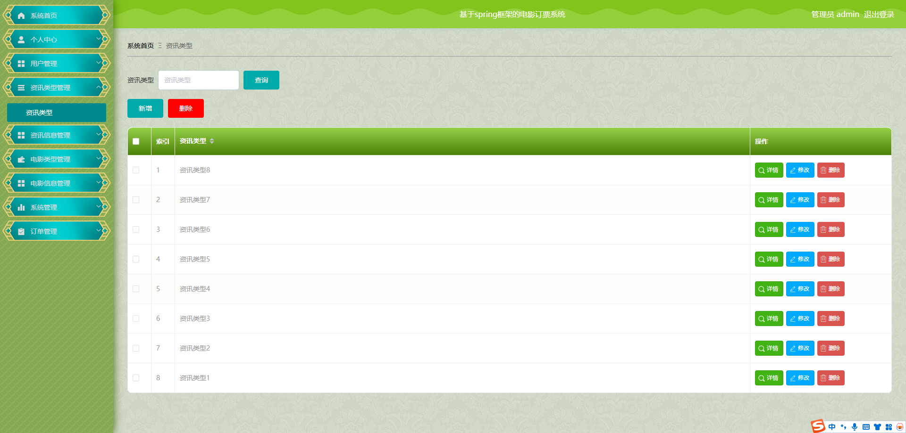

# 一、系统说明

基于springboot+vue+elementui开发的电影订票系统,系统功能齐全, 代码简洁易懂，适合小白学编程。

# 二、系统架构

######      前端：vue| elementui

######      后端：springboot | mybatis 

######      环境：jdk1.8+ | mysql8.0+ | maven

# 三、代码及数据库

# 四、相关功能介绍

#### 1).客户端

###### 1.登录

###### 2.注册

###### 3.首页

###### 4.资讯管理

###### 5.电影信息

###### 6.公告信息

###### 7.在线咨询

###### 8.个人中心

###### 9.个人中心->我的订单

###### 10.个人中心->我的收藏

###### 11.选座预定

#### 2).管理端

###### 1.登录

###### 2.个人中心->修改密码

###### 4.用户管理

包含:详情、删除、修改、查看、新增功能

###### 5.资讯类型

包含:详情、删除、修改、查看、新增功能

###### 6.资讯信息管理

包含:详情、删除、修改、查看、新增、查看评论功能

###### 7.电影类型管理

包含:新增、修改、删除、详情功能

###### 8.电影信息管理

包含:新增、修改、删除、详情、查看评论功能

###### 9.系统管理->公告信息

包含:新增、修改、删除、详情功能

###### 10.系统管理->在线咨询

包含:回复功能

###### 11.系统管理->关于我们

包含:修改、详情功能

###### 12.系统管理->轮播图管理

包含:修改、详情功能

###### 13.订单管理

包含:已取消、已退款、已发货、已支付、已完成状态

